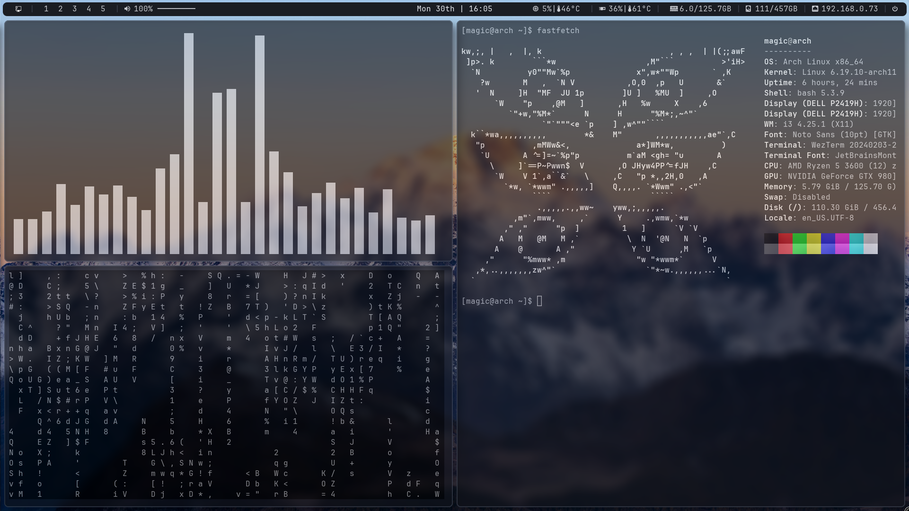

# monodrive

> a minimal, monochromatic i3 setup built around clarity and speed



---

## stack

| role | tool |
|---|---|
| window manager | i3 |
| bar | polybar |
| launcher | rofi |
| notifications | dunst |
| compositor | picom |
| terminal | wezterm |
| editor | neovim |
| file manager | thunar |
| fetch | fastfetch |
| visualizer | cava |
| font | JetBrainsMono Nerd Font |

---

## colors

```
bg        #1A1D23
bg-main   #0F1115
bg-hover  #2A2F38
border    #3A404C
fg        #C5C8CE
fg-bright #E6E9EF
accent    #E6E9EF
success   #81C784
urgent    #FF5F87
```

---

## install

### 1. clone

```bash
git clone https://github.com/YOUR_USERNAME/dotfiles.git
```

### 2. install dependencies

```bash
# official repos
sudo pacman -S i3 polybar rofi dunst picom neovim thunar fastfetch udiskie udisks2 cava cmatrix

# AUR
yay -S wezterm ttf-jetbrains-mono-nerd autotiling
```

### 3. apply configs

manually symlink or copy the configs you need from the repo to `~/.config/`.

---

## structure

```
~/.config/
├── i3/
├── polybar/
├── rofi/
├── dunst/
├── picom/
├── wezterm/
├── nvim/
├── cava/
├── Thunar/
└── fastfetch/
```

---

## notes

- colors are a custom scheme — cold whites on dark grays, no warm tones
- no automatic theming, intentionally static
- autotiling for automatic window splitting
- built on arch linux
